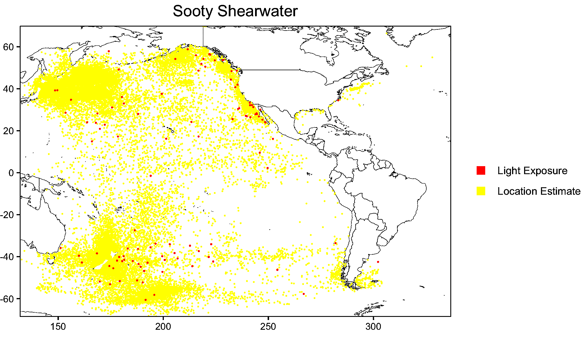

```{r setup, include=FALSE}
knitr::opts_chunk$set(echo = TRUE)
```

The package can be found [here](https://github.com/danielpetterson/probGLSAlgorithm).

# Motivation

The primary motivation behind the development of this package was to eliminate friction points, streamline data formatting and expand the capabilities of existing packages that are used to estimate locations via light-level loggers/global location sensor (GLS) tags. Due to the hardware limitations of some models of GLS tags, namely their inability to record light intensity beyond a small range, the algorithm used in `probGLS` [@merkel2016probabilistic] provides more reliable estimates than the methods available in other packages for tracking species that exist in areas of low shading. This method is used to great effect by the [SEATRACK project](https://seapop.no/en/seatrack/) to map the distribution and flight patterns of a variety of seabirds native to the North Atlantic and neighbouring areas. Last summer I worked with the Department of Conservation to assess the viability of using this method to estimate the location and frequency of artificial light events for a variety of species native to New Zealand. While the algorithm has been shown to provide accurate estimates under the right conditions, limitations in the functionality and applying it to species that had a much larger range than previously used led to issues. 

## Issues with existing packages

### Land mask

The land mask is essentially a filter that doesn't allow location estimates to be generated within the boundaries specified. In the traditional usage of this it means that location estimates will not exist on any land mass but this can also be reversed so that estimates only occur on land. `probGLS::prob_algorithm` allows for some preset extensions to the land mask and users are able to add the Mediterranean, Black, Baltic and Caspian seas. One of the goals of this package was to expand that functionality and allow for users to input custom land mask augmentations. `probGLSAlgorithm::modify.land.mask` features the following additional preset options:

* Arctic Ocean
* North Atlantic Ocean
* South Atlantic Ocean
* North Pacific Ocean
* South Pacific Ocean
* Southern Ocean 

In addition to these the function also takes in custom coordinates as defined by minimum longitude, maximum longitude, minimum latitude, maximum latitude. The output of `probGLSAlgorithm::GLS.prob.algorithm` includes a map which displays the coverage of the land mask applied for visual confirmation of the area that the custom land mask includes should it be altered. The land mask is important due to the nature of the algorithm which takes the geographic median point of each new set of location estimates as the next point in each track/iteration and the most probable path is calculated as the median path of all tracks/iterations. During the aforementioned we had issues with location estimates occuring on the other side of North America which is near impossible and occured because there was no way to restrict estimate locations besides narrowing the bounding box, the expected range of the birds. 



The attached image displays the issue clearly. The bounding box needed to allow for tracking around the southern tip of South America where the birds were known to have previously traveled but this also allowed for the estimates to be generated off the east coast of North America. With the ability to fine tune the allowed area via `probGLSAlgorithm::modify.land.mask` this is no longer an issue and skewing is less problematic. 

### Differences in formatting between devices and manufacturers

The frequency of recordings and recorded values differ between devices and its not uncommon for studies to use a mixture of models at times when availability was limited due to legal and manufacturing issues. The `read.x` series of functions was written to simplify converting the raw data into the format required for location estimation. This may be especially useful because documentation on older models is difficult to come by and often lacking.

# The process of development

## Initial concept

The package was clearly inspired by my previous work with the related packages. Through that I identified multiple modifications that I thought would be most useful to someone trying to do similar work. I had planned to include a much larger number of `read.x` functions for specific device models but realised that I could condense them quite easily. Some devices haven't been available for sale in over a decade and with the non-user replaceable batteries it was unlikely that there was a need to cover their specific formatting. I wanted the main function `GLS.prob.algorithm` to be easily swappable with `probGLS::prob_algorithm` to minimise the work required if a user wanted to migrate from the original version to take advantage of some of the functionality.

## Implementation of ideas

This part was relatively straightforward with the exception of the sliding bounding box in the main function which I couldn't manage to implement in a time/processing efficient manner. A much quicker fix was to subset the output of `GLS.prob.algorithm` and generate a new geographic median value that only took into account locations within a given hemisphere over a user-specified time frame. This functionality is found in the `geo.median.track` function. This method is less than ideal as instead of using the median values of $n$ iterations the median is often calculated from $<<n$ values.

## Testing

Proper testing required the synthesis of appropriately formatted data that aligned with data from other file types. This class has been my first experience with unit testing so there are likely a few edge cases that are not adequately covered but I feel like the chance of these occurring is quite low given the documentation and examples available in previous research.

## Deployment

The package has been updated and can be found [here](https://github.com/danielpetterson/probGLSAlgorithm) but users still need to download a handful of auxiliary data files that were not included due to their size and the requirement that the data files match the time covered in the recordings. 


# Difficulties with the package development

## Lack of open-access data

Data for package testing needed to be generated based on samples as it wasn't possible to find publicly available sources of data that fit the requirements. This is partially due the the very niche purpose of this type of equipment and partially due to it not often being used to track species that have a large latitudinal range. Reference data sets are available in `probGLS` but are small and already formatted for input into `prob_algorithm`. If I were to start this project again I would have put more effort into obtaining datafiles from a wider range of GLS tags to verify that they work as expected. The prime example of this is the `read.sensor` function which will process C65-SUPER tag data and will probably work on other models by the same company but files were not available for testing.

## The complexity of the GLS.prob.algorithm function

The `prob_algorithm` function which this is based on is quite complex and there were many issues with trying to modify the functionality within that function while ensuring that the output was as expected and an excessive number of arguments weren't created. Splitting off the functionality of `modify.land.mask` and `geo.median.track` saved a lot of stress. Originally I had planned to implement a sliding bounding box according to when a species was expected to cross the equator to lessen the inaccuracy during equinox periods but this made the function considerably slower and considering that a single year of recordings from one subject can take hours to process, lengthening the time required seemed counterproductive.

## Dependencies

I attempted to minimise the number of dependencies used unless they showed a clear benefit such as `terra`/`tidyterra` which are significantly faster than the `raster` alternatives. A handful of operations were problematic to get working in base R so `dplyr` was required. This seemed a reasonable trade off as the tidyverse has continued support and most R users would already have `dplyr` installed. I opted to use the base R piping function instead of the more commonly seen `magrittr` pipe. This meant that a newer version of R was required but that seemed preferable to adding another dependency. The number of dependencies could be reduced if there was the need for it.

# Getting Started

The package depends on the installation of other packages not currently available on CRAN so these will need to be installed via Github. If you don't have `devtools` installed already, install it first.

```{r, eval = F}
install.packages("devtools")
devtools::install_github("slisovski/GeoLight")
devtools::install_github("SWotherspoon/SGAT")
devtools::install_github("benjamin-merkel/probGLS")
devtools::install_github("danielpetterson/probGLSAlgorithm")
library(probGLSAlgorithm)
```


## Importing Data

### Light Data

The first step is to load your raw data into R. Different geolocator models provide raw data in different formats. The most common geolocators are manufactured by Migrate Technology Ltd. and BAS/Biotrack and use the file extensions `.lux` and .lig` respectively. The GeoLight package includes functions to read in data from both these file types.

```{r, eval = F}
GeoLight::luxTrans("file.lux")
GeoLight::ligTrans("file.lig")
```

Light data is used to define twilight events using the threshold method. This can be done in R using `GeoLight::twilightCalc` and its advisable to set `ask` to `TRUE` so that you can manually remove any erroneous twilight estimates that result from shading. While it is possible to carry out this operation in R, each manufacturer supplies dedicated software to achieve this and using them means avoiding the issues that plague `GeoLight::twilightCalc` such as being unable to go back and modify your selection and poor visibility near the edges of the plot. If proprietary software is used then the output will be a .trn file. This can be read into R using the following function.

```{r, eval = F}
trn <- read.trn("file.trn")
```

### Saltwater Immersion Data

Some loggers record whether they are wet or dry based on conductivity sensors. While this data is not necessary to calculate location estimates, it can help to increase accuracy as species have different speed distributions depending on whether the are assumed to be in water or in flight. The sampling interval is device specific and you will want to check the individual data files before using this function.

```{r, eval = F}
act <- read.act(actfile, sampling.interval = 3, summarise.interval = 10)
```


### Temperature Data

Temperature data from MK7, MK15 and C65-SUPER GLS loggers can be formatted using the `read.sensor` function. `read.sensor` outputs a dataframe containing median daily sea surface temperature to be cross-referenced against recordings found in the auxillary data for more accurate location estimates.

```{r, eval = F}
sen <- read.sensor(temfile, logger.type = "MK15", temp.range = c(-2,19))
```

### Landmask Customisation

The landmask defines the area where location estimates will not be made if set to work with seabirds. It can also be used for land based animals by setting the land.mask argument in `GLS.prob.algorithm` to `FALSE`. This area can be expanded using the `modify.land.mask` function. There are a series of preset options as well as the ability to specify custom areas.

```{r, eval = F}
land.mask.mod <- modify.land.mask(
  med.sea = T,
  black.sea = T,
  baltic.sea = T,
  caspian.sea = T,
  arctic.ocean = F,
  north.atlantic.ocean = T,
  south.atlantic.ocean = T,
  north.pacific.ocean = F,
  south.pacific.ocean = F,
  southern.ocean = F,
  custom.land.mask = NULL
)
```

The bounding box specifies the maximum range that an animal is expected to travel through. The landmask can be used to effectively restrict estimates to areas within that simple box where the animal could possibly be. This is especially useful to avoid implausible estimates during equinox periods.

### Auxillary Files

A number of external files are required to run the algorithm. These include the landmask file that marks out the borders of all significant landmasses, measurements of the regional concentration of ice, and the daily sea surface temperature and error. Below is an example of the files needed for 2014. You will need to download all the files for the years corresponding to the duration of your data and place them in the same folder.

```
sst.day.err.2014.nc
(https://downloads.psl.noaa.gov//Datasets/noaa.oisst.v2.highres/sst.day.err.2014.nc)

sst.day.mean.2014.nc
(https://downloads.psl.noaa.gov//Datasets/noaa.oisst.v2.highres/sst.day.mean.2014.nc)

icec.day.mean.2014.nc
(https://downloads.psl.noaa.gov//Datasets/noaa.oisst.v2.highres/icec.day.mean.2014.nc)

lsmask.oisst.v2.nc
(https://psl.noaa.gov/repository/entry/show?entryid=synth%3Ae570c8f9-ec09-4e89-93b4-babd5651e7a9%3AL25vYWEub2lzc3QudjIuaGlnaHJlcy9sc21hc2sub2lzc3QudjIubmM%3D)
```


### GLS.prob.algorithm

This function is based on `probGLS::prob_algorithm` but allows for defining landmask customisations. The sixth element of the output 

```{r, eval = F, results='hide'}
# light data
trn           <- GeoLight::twilightCalc(probGLS::BBA_lux$dtime, probGLS::BBA_lux$lig, ask = FALSE, LightThreshold = 2)
# sst data
sen        <- probGLS::sst_deduction(datetime = probGLS::BBA_sst$dtime, temp = probGLS::BBA_sst$temp, temp.range = c(-2,30))
# wet dry data
act           <- probGLS::BBA_deg[probGLS::BBA_deg$wet.dry=="wet",]
act$wetdry    <- act$duration
# land mask mod
land.mask.mod <- modify.land.mask(med.sea = T)
# twilight sd
twilightSD <- probGLS::twilight_error_estimation(2.49, 0.94, 4.98)


pr <- GLS.prob.algorithm(
  particle.number = 10, #number of particles per step
  iteration.number = 5, #number of iterations/tracks to calculate
  loess.quartile = NULL, #quartiles for loessFilter (GeoLight), if NULL loess filter is not used
  tagging.location = c(-36.816, -54.316), #dataset-specific
  tagging.date = as.POSIXct("2014-12-13 17:55", tz = "UTC"), #dataset-specific
  retrieval.date = as.POSIXct("2014-12-22 08:55", tz = "UTC"), #dataset-specific
  sunrise.sd = twilightSD, #generic for open-habitat species like seabirds
  sunset.sd = twilightSD, #generic for open-habitat species like seabirds
  range.solar = c(-7, -1), #range of solar angles to consider
  speed.wet = c(1, 1.3, 5), #species-specific distribution of speed when in water. Generally set to match the speed of the local current.
  speed.dry = c(20, 0.2, 25), #species-specific distribution of speed when not in water/flying. (optimal speed, sd, max speed)
  sst.sd = 0.5, #standard deviation of sea-surface temperature
  max.sst.diff = 3, #maximum sst difference to be considered
  days.around.spring.equinox = c(10, 10), #number of days around equinox to apply the correction outlined in the probGLS paper
  days.around.fall.equinox = c(10, 10), #note that spring and fall are relative to the northern hemisphere.
  ice.conc.cutoff = 1, #max percentage of sea ice in which the animal is believed to be
  boundary.box = c(-120, 40, -90, 0), #species-specific expected range of possible locations
  east.west.comp = T,#related to tagging location
  land.mask = T, #T to exclude location estimates on land, F to exclude estimates at sea, NULL to apply no land mask.
  sensor = sen,
  trn = trn,
  act = act,
  wetdry.resolution = 30, #device/manufacturer dependent. Sampling frequency of act file
  backward = F, #run the algorithm backwards. Can be useful if there are issues around equinox periods.
  NOAA.OI.location = "../tests/testthat/EnvironmentalData_BAS", # location of auxillary files
  land.mask.mod = land.mask.mod #object from modify.land.mask or NULL if no augmentation of landmask is required.
)
```

To access a list of plots containing more detailed information on the location estimates at each timestep you can use the plot method on the glsTracks object.

```{r, eval = F}
plot.list <- plot(pr, zoom = TRUE)
```


### Resolving issues with bounding boxes that cross the equator

Some animals such as larger seabirds can have immense ranges. During the defined equinox periods, the speed distributions are ignored and latitiude values are sampled randomly from the entire range of the bounding box. This can result in what appears as massive movements in a very short amount of time. To remedy this it is advised to used the `geo.median.track` function if you know which hemisphere you expect the animal to be in over a given period. The function served to recalculate the median path using only tracks from that hemisphere which should increase the accuracy of the estimates. If there are no tracks estimated in that hemisphere at any timepoint then the original median track value will be retained.

```{r, eval = F}
modified.track <- geo.median.track(pr, cross.north = NULL, cross.south = "2014-12-20")
```

